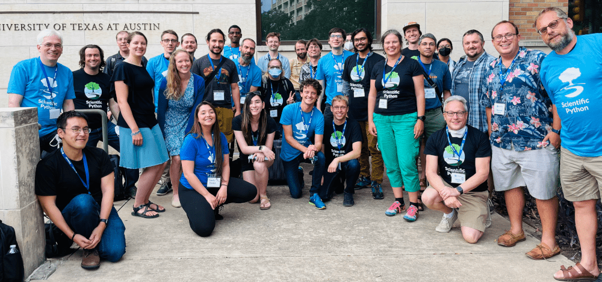

<b>TODO add alttext and make this a gallery of pictures (maybe cycling and clickable)</b>

## Join the discussion

Healthy communities are built when everyone's voice is heard,
when their perspective is valued, and when their work is recognized.
Better technical and social solutions can be found through wide participation.
We are therefore dedicated to expanding our community in a welcoming and inclusive way,
with particular focus on increased participation by people who identify with groups that are
underrepresented in STEM and the open source scientific Python community.

The community consists of a group of developers, maintainers, and users of tools in the Scientific Python ecosystem.
Those who participate in the project must adhere to our [community code of conduct](https://scientific-python.org/code_of_conduct/).

- [Discussion forum](https://discuss.scientific-python.org), where you can be part of ongoing conversations about the Scientific Python ecosystem;
- [Discord server](https://discord.gg/vur45CbwMz) for synchronous communication with members of the community.
